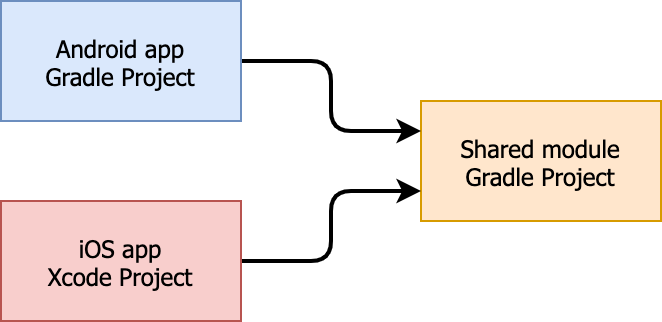
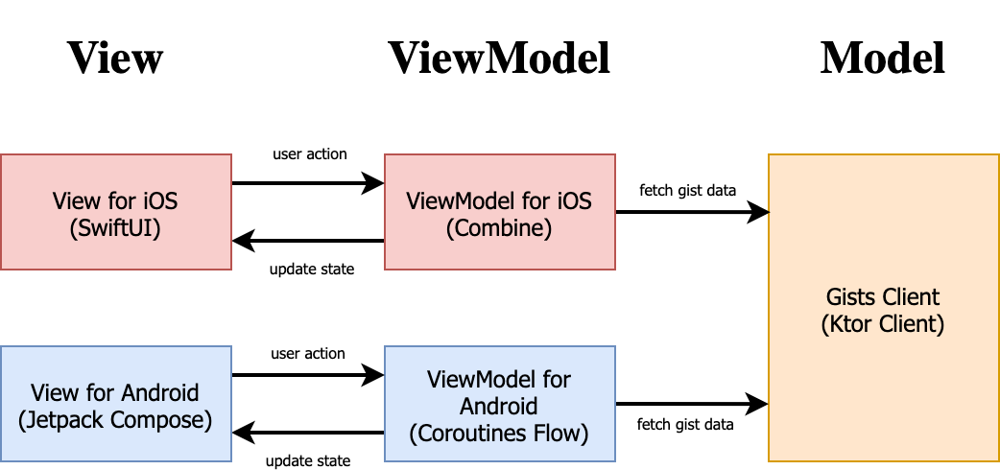

# KMM Sample: Gist Client for Android and iOS

This is Kotlin Multiplatform Mobile (KMM) Project. It includes gist client applications for Android and iOS.

## Application Features

- display gist title and created date.
- display gist file contents.

## Project Structure

This application adapted default KMM project structure.

## Architecture

This application adapted MVVM architecture. Each layer is implemented using following libraries.

### View

| Platform | Libraries       |
| -------- | --------------- |
| iOS      | SwiftUI         |
| Android  | Jetpack Compose |

### ViewModel

| Platform | Libraries                             |
| -------- | ------------------------------------- |
| iOS      | Combine                               |
| Android  | Android ViewModel and Coroutines Flow |

### Model

| Platform      | Libraries |
| ------------- | --------- |
| iOS / Android | Ktor      |

